# eShopOnWeb: 4+1 Architectural Views

> **Reverse-engineered** from the codebase. Describes the architecture of the eShopOnWeb ASP.NET Core reference application—a monolithic e-commerce web app demonstrating traditional web development patterns.

**Related documentation**:
- [Use Case Specifications](use-case-specifications.md) – UC-001 through UC-015 with flows and code mapping
- [Practices Guide](practices-guide.md) – BDD, TDD, and use case documentation practices

---

## Overview

eShopOnWeb is a single-process (monolithic) ASP.NET Core application with:
- **Web**: MVC + Razor Pages for storefront and identity
- **PublicApi**: REST API (minimal API endpoints) for Blazor Admin
- **BlazorAdmin**: Blazor WebAssembly admin UI (catalog CRUD)
- **ApplicationCore**: Domain entities, interfaces, services
- **Infrastructure**: Data access, identity, external services
- **BlazorShared**: Shared DTOs and interfaces for Blazor/API

---

## 1. Logical View

The logical view describes the key abstractions and domain model.

### Domain Entities (ApplicationCore)

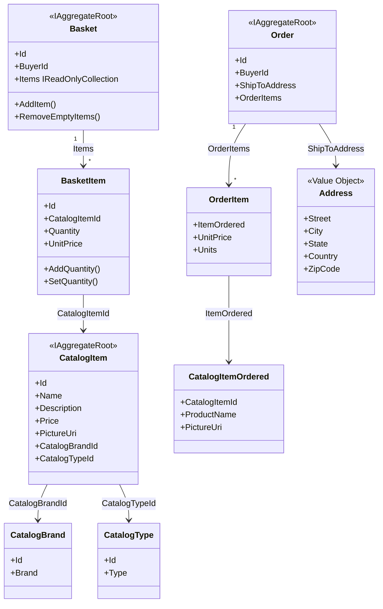

### Key Interfaces

| Interface | Purpose |
|-----------|---------|
| `IRepository<T>` | Generic CRUD for aggregates |
| `IReadRepository<T>` | Read-only repository |
| `IBasketService` | Add item, set quantities, transfer, delete basket |
| `IOrderService` | Create order from basket |
| `ICatalogViewModelService` | Catalog with filters, pagination, brands, types |
| `IBasketViewModelService` | Basket view model mapping |
| `IUriComposer` | Compose picture URIs with base URL |
| `IEmailSender` | Send email (e.g., confirmation) |
| `ITokenClaimsService` | JWT claim generation |

### Specifications (Query Objects)

- `CatalogFilterSpecification`, `CatalogFilterPaginatedSpecification` – filter by brand/type, paginate
- `CatalogItemsSpecification` – load catalog items by IDs
- `BasketWithItemsSpecification` – basket by buyer ID or basket ID with items
- `CustomerOrdersSpecification` – orders by buyer ID
- `OrderWithItemsByIdSpec` – order with items by order ID

### Key Domain Services

- **BasketService**: AddItemToBasket, SetQuantities, TransferBasketAsync, DeleteBasketAsync
- **OrderService**: CreateOrderAsync (from basket + address)

### Logical Interaction Flows

The following sequence diagrams show domain-level interactions between entities and services. These complement the process-view diagrams, which describe physical request flows.

#### Add Item to Basket

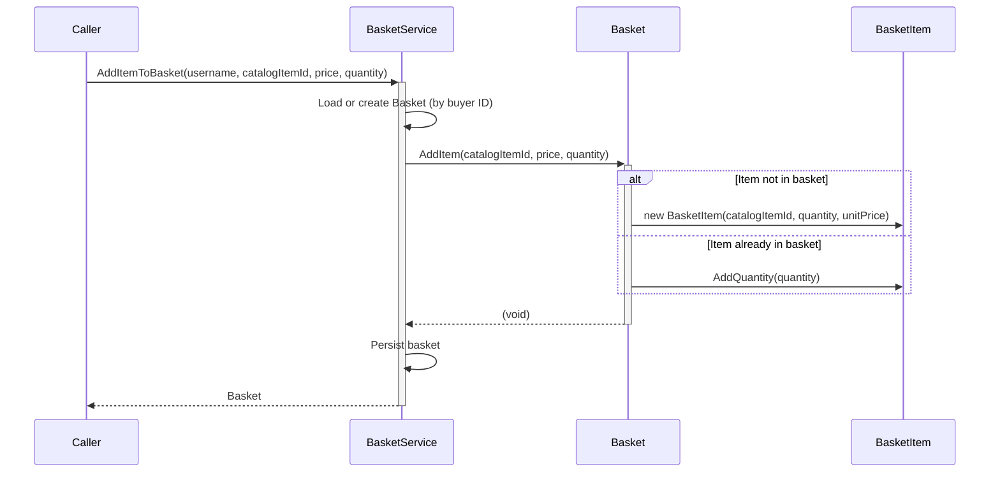

#### Checkout (Create Order)

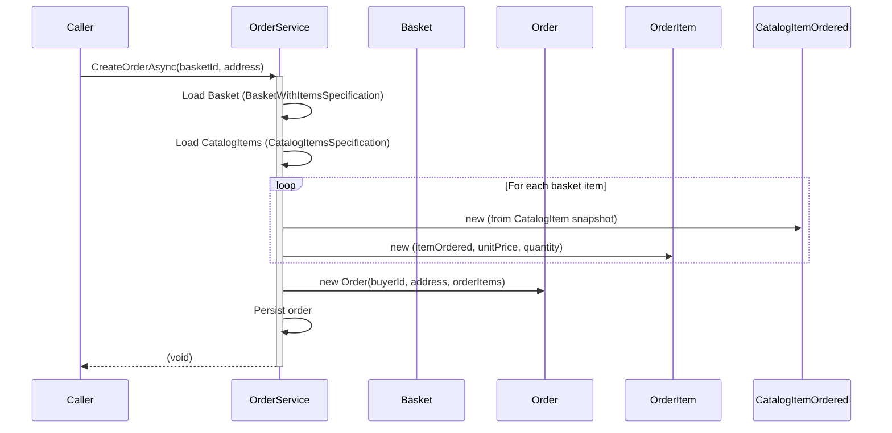

#### Basket Transfer on Login

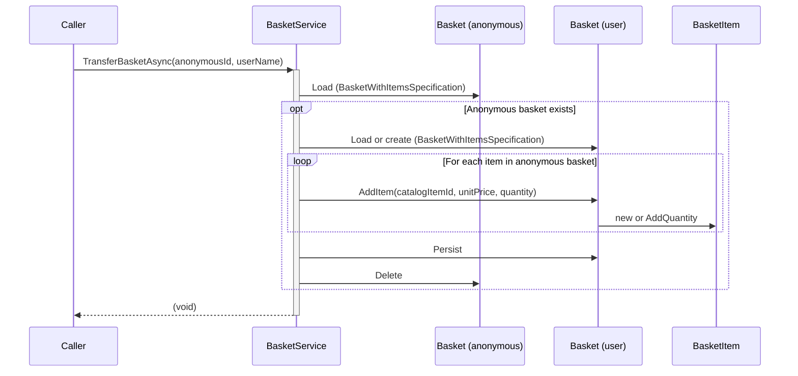

#### Update Basket Quantities

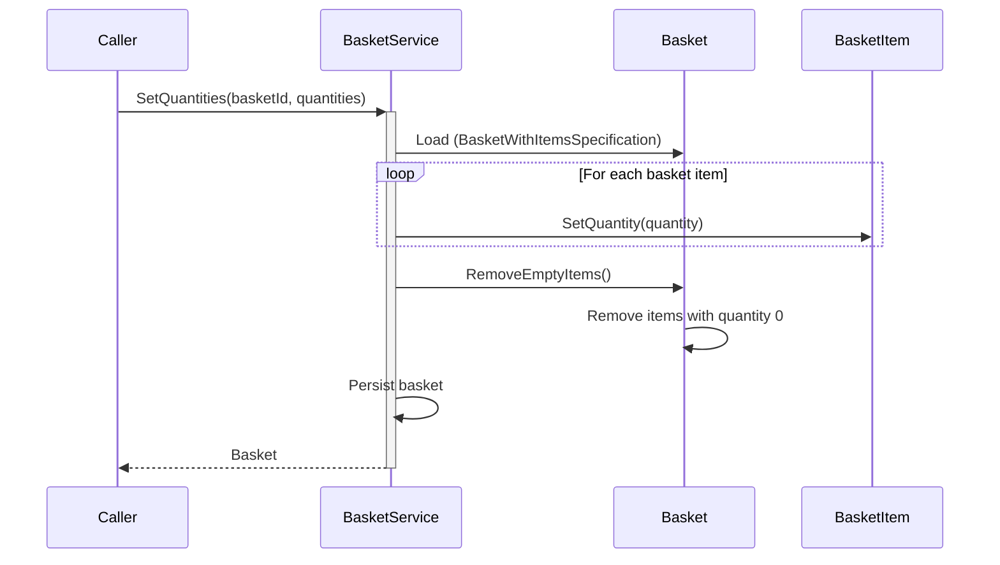

### Exceptions

- `EmptyBasketOnCheckoutException` – basket has no items at checkout
- `DuplicateException` – (defined, usage varies)

---

## 2. Process View

The process view describes runtime behavior, concurrency, and communication.

### Request Flow: Storefront (Web)

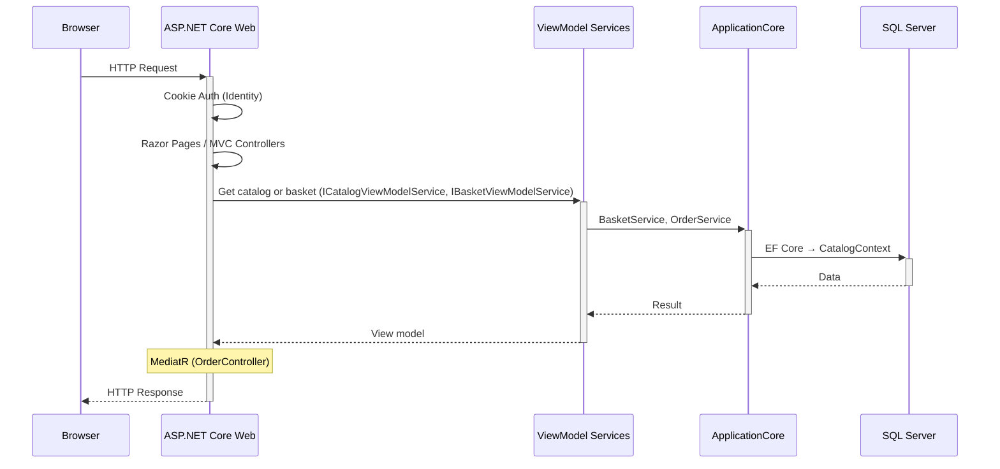

### Request Flow: Admin (Blazor + PublicApi)

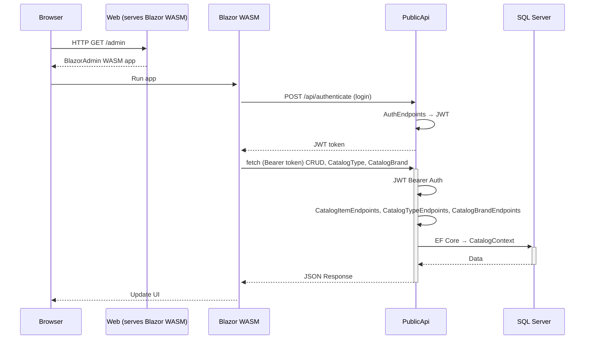

### Concurrency Model

- **Web**: Single process, request-scoped DbContext per HTTP request
- **PublicApi**: Single process, request-scoped DbContext
- **Database**: Shared SQL Server; CatalogContext (catalog, basket, orders) and AppIdentityDbContext (identity) are separate databases
- No explicit background jobs or message queues in the codebase
- In-memory cache (IMemoryCache) for catalog brands/types/items—shared within process

### Basket Transfer on Login

When anonymous user logs in, `TransferBasketAsync` is invoked from `LoginModel.OnPostAsync` (after successful sign-in) via `TransferAnonymousBasketToUserAsync` to merge anonymous basket into user basket and delete anonymous basket.

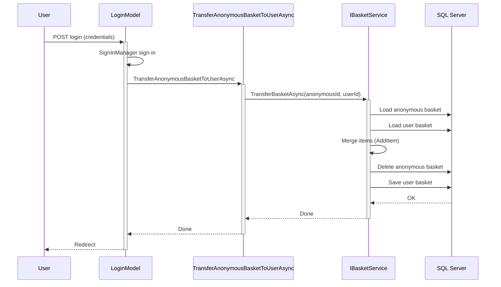

---

## 3. Development View

The development view describes the module structure and dependencies.

### Solution Structure

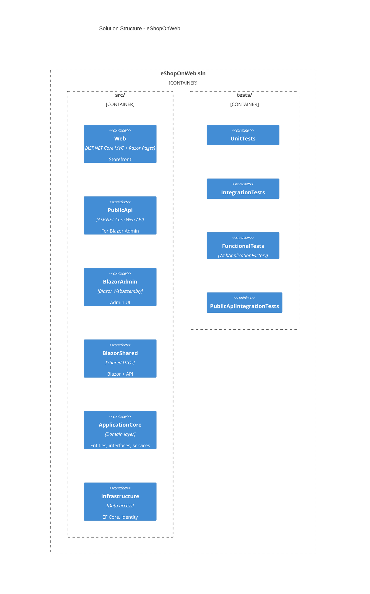

### Dependency Graph

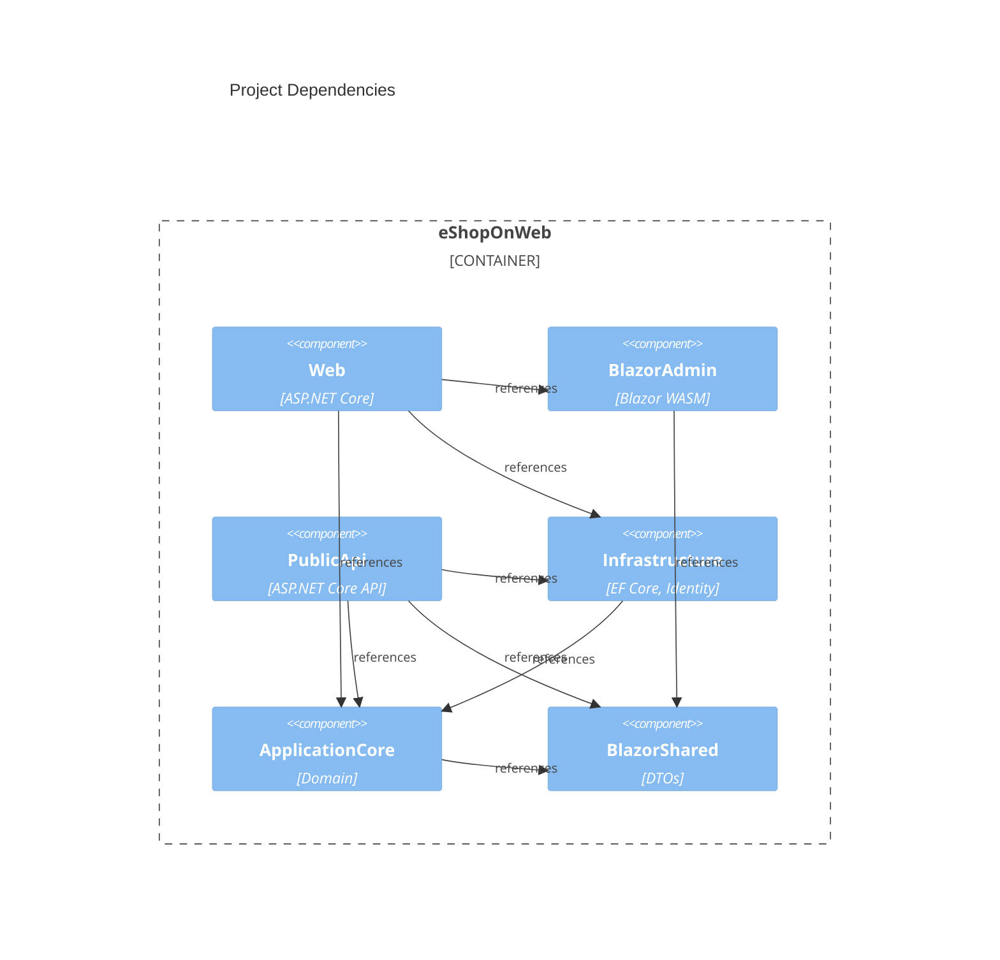

- **ApplicationCore**: No dependencies on Web, Infrastructure, or Blazor. References BlazorShared for shared types.
- **Infrastructure**: Depends on ApplicationCore. Implements IRepository, identity, EmailSender.
- **Web**: Depends on ApplicationCore, Infrastructure, BlazorAdmin, BlazorShared. Hosts storefront and serves Blazor Admin.
- **PublicApi**: Depends on ApplicationCore, Infrastructure, BlazorShared. Standalone API for Blazor Admin.
- **BlazorAdmin**: Depends on BlazorShared. Calls PublicApi via HttpClient.

### Key Technologies

| Layer | Technologies |
|-------|--------------|
| Web | ASP.NET Core 8, MVC, Razor Pages, Cookie Auth, MediatR, Blazor Server (admin host) |
| PublicApi | ASP.NET Core, Minimal API (MinimalApi.Endpoint), JWT Bearer, Swagger, AutoMapper |
| BlazorAdmin | Blazor WebAssembly, Blazored.LocalStorage, HttpClient |
| ApplicationCore | Ardalis.GuardClauses, Ardalis.Result, Ardalis.Specification |
| Infrastructure | EF Core, SQL Server, ASP.NET Core Identity |

### Configuration

- **Web**: appsettings.json, optional Azure Key Vault in production, BaseUrlConfiguration for PublicApi base URL
- **PublicApi**: appsettings.json, CORS from Web base URL, JWT secret (AuthorizationConstants.JWT_SECRET_KEY)

---

## 4. Physical View

The physical view describes deployment topology.

### Docker Compose (Local/Dev)

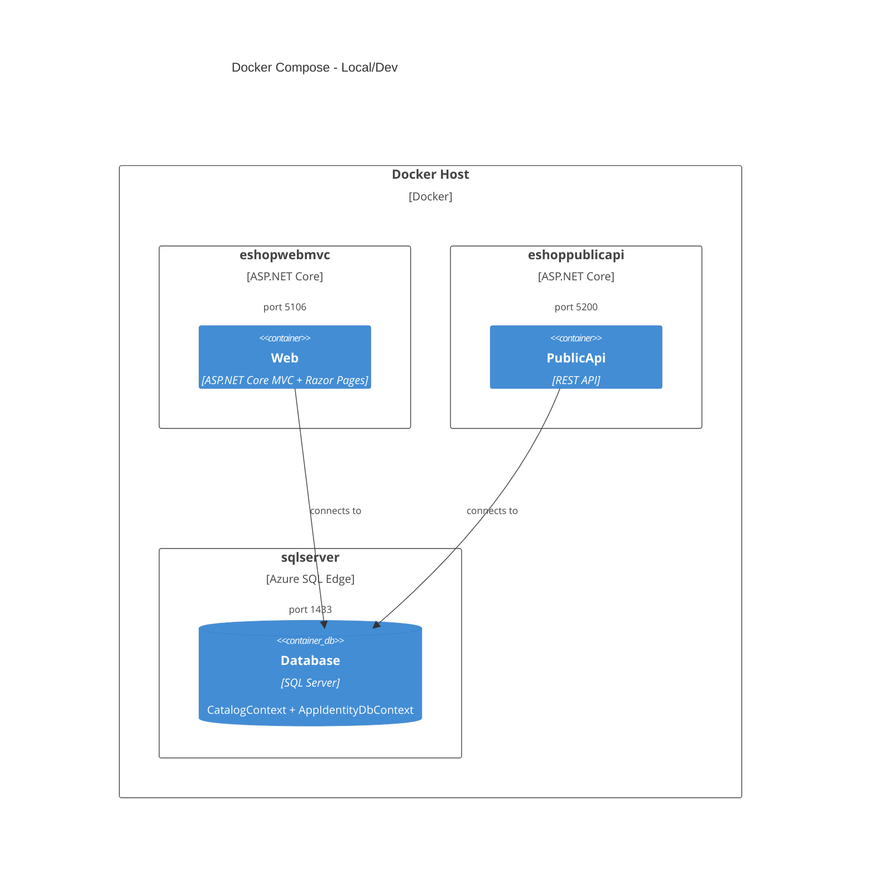

### Local Development (without Docker)

- **Web**: `dotnet run` from Web folder (or `--launch-profile Web`)
- **PublicApi**: `dotnet run` from PublicApi folder (required for admin)
- **SQL Server**: Local or SQL Server Express; two databases: catalog + identity
- **BlazorAdmin**: Served by Web at `/admin`; fetches from PublicApi

### Azure Deployment (azd)

- Uses `azd up` to provision and deploy
- Configuration from Azure Key Vault (connection strings)
- Resource group: `rg-{env name}`

### Data Stores

| Context | Database | Contents |
|---------|----------|----------|
| CatalogContext | SQL Server | CatalogItem, CatalogBrand, CatalogType, Basket, BasketItem, Order, OrderItem |
| AppIdentityDbContext | SQL Server | AspNetUsers, AspNetRoles, AspNetUserClaims, etc. |

---

## 5. Scenarios (+1)

Scenarios tie the four views together by showing how key use cases traverse the system.

### Scenario 1: Shopper Browses Catalog and Adds to Basket

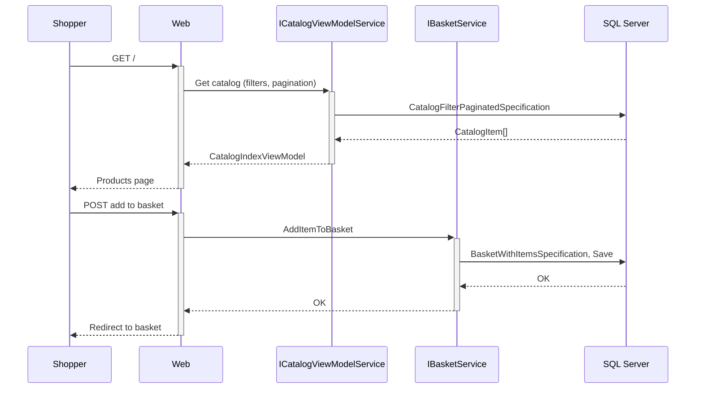

| Step | Logical | Process | Development | Physical |
|------|---------|---------|-------------|----------|
| 1 | Shopper requests home page | HTTP GET / | Web Index page, ICatalogViewModelService | Browser → Web |
| 2 | Load catalog with filters | CatalogFilterPaginatedSpecification, IRepository<CatalogItem> | ApplicationCore + Infrastructure | Web → SQL Server |
| 3 | Display products | CatalogIndexViewModel, Razor | Web | Web → Browser |
| 4 | Add to basket | IBasketService.AddItemToBasket | ApplicationCore BasketService | Browser POST → Web |
| 5 | Persist basket | BasketWithItemsSpecification, IRepository<Basket> | Infrastructure EfRepository | Web → SQL Server |
| 6 | Redirect to basket | BasketViewModelService | Web | Web → Browser |

### Scenario 2: Authenticated Shopper Checks Out

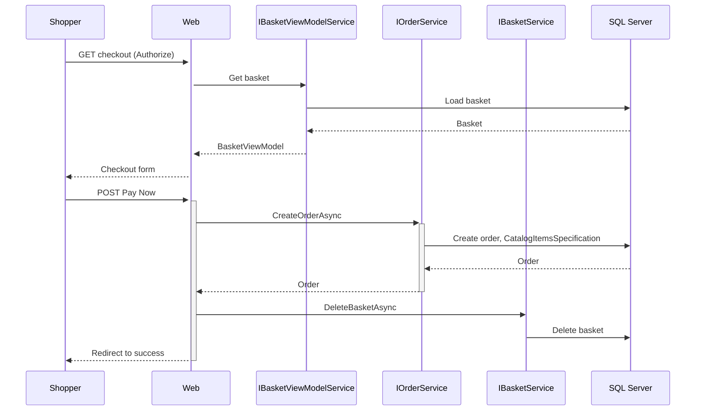

| Step | Logical | Process | Development | Physical |
|------|---------|---------|-------------|----------|
| 1 | Navigate to checkout | Authorize → redirect if not logged in | Web Basket/Checkout | Browser → Web |
| 2 | Load basket | IBasketViewModelService | Web | Web → SQL Server |
| 3 | Submit "Pay Now" | IOrderService.CreateOrderAsync | ApplicationCore OrderService | Browser POST → Web |
| 4 | Create order | Order aggregate, CatalogItemsSpecification | ApplicationCore + Infrastructure | Web → SQL Server |
| 5 | Delete basket | IBasketService.DeleteBasketAsync | ApplicationCore | Web → SQL Server |
| 6 | Redirect to success | Basket/Success page | Web | Web → Browser |

### Scenario 3: Admin Creates Catalog Item

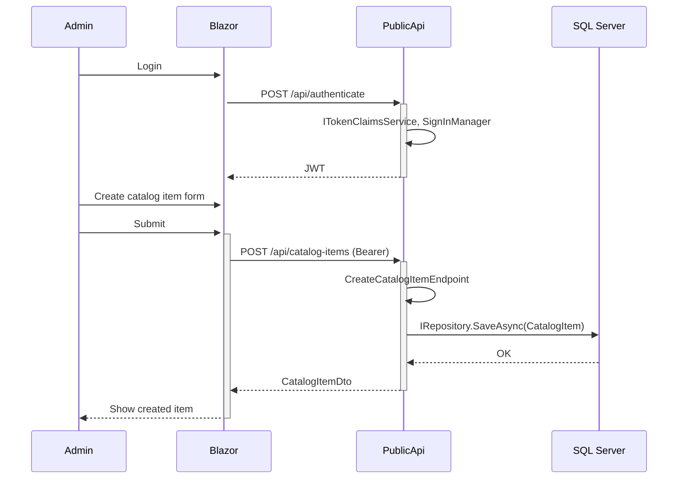

| Step | Logical | Process | Development | Physical |
|------|---------|---------|-------------|----------|
| 1 | Admin logs in via Blazor | POST /api/authenticate | PublicApi AuthenticateEndpoint | Blazor → PublicApi |
| 2 | Receive JWT | ITokenClaimsService, SignInManager | Infrastructure | PublicApi → Blazor |
| 3 | Create catalog item form | ICatalogItemService | BlazorAdmin | Browser |
| 4 | Submit create | POST /api/catalog-items (Bearer token) | PublicApi CreateCatalogItemEndpoint | Blazor → PublicApi |
| 5 | Validate & persist | IRepository<CatalogItem>, CatalogItem | Infrastructure | PublicApi → SQL Server |
| 6 | Return created item | CatalogItemDto | PublicApi + BlazorShared | PublicApi → Blazor |

### Scenario 4: Anonymous User Logs In (Basket Transfer)

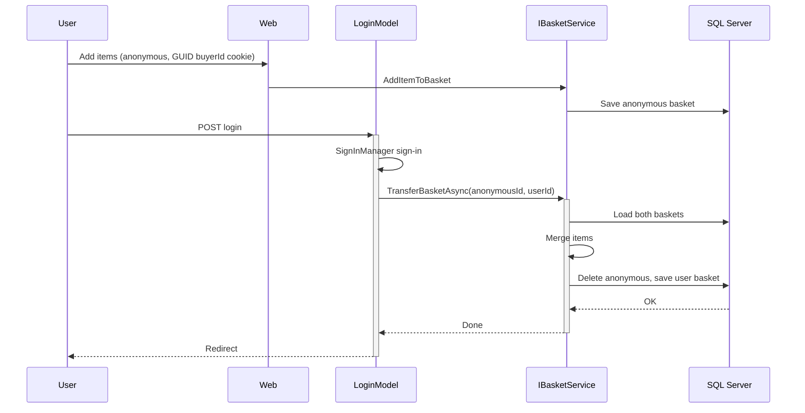

| Step | Logical | Process | Development | Physical |
|------|---------|---------|-------------|----------|
| 1 | Anonymous adds items | Basket with GUID buyer ID (cookie) | Web, IBasketService | Browser → Web |
| 2 | User logs in | Identity/Account/Login | Web, SignInManager | Browser POST → Web |
| 3 | Sign-in succeeds | LoginModel.OnPostAsync → TransferAnonymousBasketToUserAsync | Web Identity/Account/Login | Web |
| 4 | Transfer basket | IBasketService.TransferBasketAsync | ApplicationCore BasketService | Web → SQL Server |
| 5 | Merge baskets | Anonymous basket items → user basket | Basket.AddItem | In-process |
| 6 | Delete anonymous basket | IRepository.DeleteAsync | Infrastructure | Web → SQL Server |

---

## Summary

| View | Summary |
|------|---------|
| **Logical** | Domain aggregates (Catalog, Basket, Order), services (Basket, Order), specifications, value objects |
| **Process** | Request/response over HTTP; Web + PublicApi as separate processes; shared SQL Server; in-memory cache |
| **Development** | Clean architecture: Core → Infrastructure; Web and PublicApi as delivery mechanisms; BlazorAdmin as SPA |
| **Physical** | Docker: Web (5106), PublicApi (5200), SQL Server (1433); optional Azure deployment |
| **Scenarios** | Browse → Add to basket → Checkout; Admin CRUD via PublicApi; basket transfer on login |
